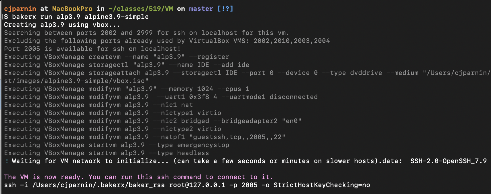
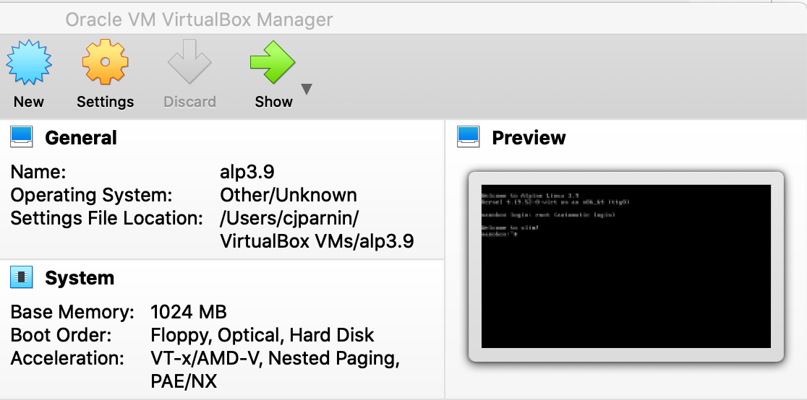
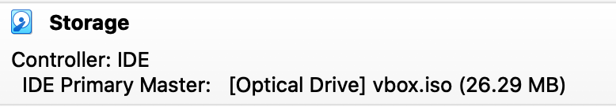
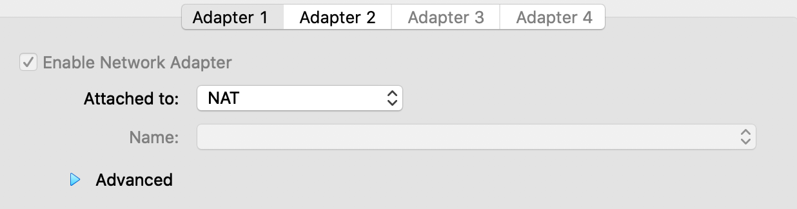
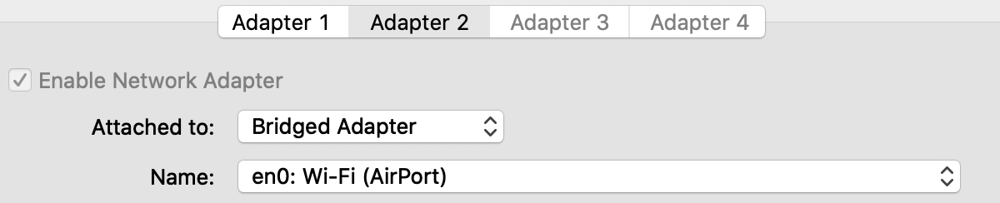
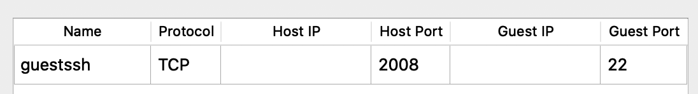

# VM

In this workshop, we will be exploring concepts related to virtualization by understanding virtualization concepts in depth, and then manually constructing a virtual machine.

## Preqs

You must be able to pass the `opunit` checks for virtualization, and `bakerx`, and `VirtualBox` installed.
You may need to seek help if you are unable to get virtualization to work on your device.

You can *import* this workshop as a notebook, or manually run the instructions in a terminal and editor.

```bash | {type: 'command'}
docable-server import https://github.com/CSC-DevOps/VM
```

## Hello, Virtual Machine.

We will create a simple virtual machine using `bakerx`. Our primary goal is to ensure the basics are working, we will not be doing anything fancy&mdash;yet. We will explain all the bits in the next section.

### Getting virtual machine image

Pull an 3.9 alpine image.

```bash | {type:'command', stream: true}
bakerx pull alpine3.9-simple ottomatica/slim#images 
```

Check which images are available on your system.

```bash | {type:'command'}
bakerx images
```

Verify your image downloaded.

```
│  'alpine3.9-simple'     │ 'vbox.iso' │ 'qemu,vbox' │
```

**Error**: If your image download failed, or failed to extract, you can run the following to delete the image. You can then try to run the `pull` command again.

```bash | {type:'command'}
bakerx delete image alpine3.9-simple
```

### Creating virtual machine instance.

Create a new VM instance, named "alp3.9".

```bash | {type: 'command', stream: true, failed_when: 'exitCode !=0'}
bakerx run alp3.9 alpine3.9-simple
```

⚠️: If this command does not complete successfully, there is likely an issue with virtualization on your machine. You should move on to the next section to see if you can get more information about your machine, and then reach out to the message board for help.

<!--  -->

### Connecting to VM via ssh.

Using the ssh command provided `bakerx ssh alp3.9`, so we can connect to the virtual machine. You can use `exit` to end your ssh sesssion.

```bash | {type: 'repl'}
```


## Virtual Machine Inspection through VirtualBox Show.

Let's ensure we can interact with the VM by clicking "Show". This will open a small terminal into virtual box. This is useful for quickly determining if your VM is working, which could fail to boot, or otherwise not be reachable if networking is broken.



Close the preview window, but still leave the VM "Continue running in the background".

### Storage/Disk



The image is loaded as a DVD into a disk drive. _Note: the size of the image: 26MB_.

### Power and VM State

You can control when a VM is running, saved, or turned off.

When a virtual machine is not being used, you have to option to "Power-off" the machine, which is essentially like pulling the power cord on a machine. There is a small risk that any work you saved on the virtual disk may not be persisted in the event of a sudden outtage.

You can also "Save" the VM machine, which will persist the entire state of the machine, including RAM. Similiarly, you can take a "Snapshot" which will copy the state of the VM.

**Persistance lost:** In this case, because the only storage available to our micro VM is a disk drive, if you pull the plug, everything you changed is lost.

Short demo:

> Let's add a file.  
> Power off the VM.  
> Start the VM again. Where's the file?

_Note:_ However, _saving_ the VM will still persist the file, as the RAM contents are still perserved.

### Virtual Networking 

Your VM would not be very useful if it does not have any way to connect to a network. There are four primary ways to virtualize the network:

* **Network Address Translation (NAT)**
  
  A NAT network provides a simple way for your VM to connect to external networks. Incoming network requests are translated by the virtualization software and routed to the appropriate VM.


  Inside the VM, the network will appear as a private network.
  ```bash
  nanobox:~# ifconfig
  eth0      Link encap:Ethernet  HWaddr 08:00:27:DE:D2:AD  
            inet addr:10.0.2.15  Bcast:10.0.2.255  Mask:255.255.255.0
            inet6 addr: fe80::a00:27ff:fede:d2ad/64 Scope:Link
            UP BROADCAST RUNNING MULTICAST  MTU:1500  Metric:1
   ```

   The address will not be addressable from the host machine.
   ```bash
   $ ping 10.0.2.15
   PING 10.0.2.15 (10.0.2.15): 56 data bytes
   Request timeout for icmp_seq 0
   Request timeout for icmp_seq 1
   ```

* **Bridged network**
   
   A bridged network will share a host network interface, by filtering and routing network traffic belonging to the VM to a virtual network interface. In effect, your VM is on the same network as your host computer.

   On the host computer, you can see the following network.
   ```
   $ ifconfig
   en0: flags=8863<UP,BROADCAST,SMART,RUNNING,SIMPLEX,MULTICAST> mtu 1500 options=400<CHANNEL_IO>
      inet6 fe80::4f:70a1:5a:8e6a%en0 prefixlen 64 secured scopeid 0x5 
      inet 10.154.40.185 netmask 0xffffc000 broadcast 10.154.63.255
   ```

   Inside the VM, it shares the same 10.154.x.x subnet as the host.

   ```bash
   nanobox:~# ifconfig
   eth1      Link encap:Ethernet  HWaddr 08:00:27:EF:CE:8F  
             inet addr:10.154.62.77  Bcast:10.154.63.255  Mask:255.255.192.0
   ```

   A bridged network can be useful if you want to interact with your VM from your host or even other computers on your network.

* **Internal network**

  An internal network allows multiple VMs on the same internal network to communicate; however, the network cannot be reached by the host. 

* **Host-Only network**

  A host-only network creates a local loopback network on the host machine. Hosts and VMs can then communicate on the host-only network.

  ```bash
  $ ifconfig
  vboxnet24: flags=8843<UP,BROADCAST,RUNNING,SIMPLEX,MULTICAST> mtu 1500
	ether 0a:00:27:00:00:18 
	inet 172.30.25.1 netmask 0xffffff00 broadcast 172.30.25.255
  ```

  Typically, VMs are statically assigned an IP address on the host-only network.

  One disadvantange of a host-only network is that it requires sudo/admin privilenges to create the host-only network on the host (the first time it is created).


Finally, another strategy to allow access to your VM without requiring additional network configuration on the host or VM is to use _port forwarding_, which is usually used in addition to NAT networking. For example, you can see this configuration setting in Networking => Adapter 1 => Advanced => Port Forwarding.



### How bakerx worked.

How did `bakerx` create the micro VM?

`bakerx` will first look for an available port for forwarding the ssh connection. It reads through other VMs in virtualbox and will exclude ports already used by machines (even dormant/powered off ones) as well as ports actively used on the host.

```
$ bakerx run alp3.9 alpine3.9-simple
Creating alp3.9 using vbox...
Searching between ports 2002 and 2999 for ssh on localhost for this vm.
Excluding the following ports already used by VirtualBox VMS: 2002,2010,2003,2004,2005,2006,2007
Port 2008 is available for ssh on localhost!
```

Then, the machine "alp3.9" is registered with VirtualBox, but not running or usable.

```
Executing VBoxManage createvm --name "alp3.9" --register
```

A simple storage device is added to the VM, like a hard drive. However, in this case, it is more like an optical drive (CD/DVD). This is like loading a CD with the `alpine3.9-simple` into a disk drive and booting a machine. Just how live distributions of linux work.

```
Executing VBoxManage storagectl "alp3.9" --name IDE --add ide
Executing VBoxManage storageattach alp3.9 --storagectl IDE --port 0 --device 0 --type dvddrive --medium "/Users/cjparnin/.bakerx/.persist/images/alpine3.9-simple/vbox.iso"
```

Set the memory size and number of CPUs. Turn off the serial port, which can result in occasional boot errors.

```
Executing VBoxManage modifyvm "alp3.9" --memory 1024 --cpus 1
Executing VBoxManage modifyvm alp3.9  --uart1 0x3f8 4 --uartmode1 disconnected
```

Create a network interface (eth0) configured with NAT networking.
Create a network interface (eth1) configured with bridged networking with the wireless interface (en0) on the host machine. Finally, add a portforward [host:2008 => VM:22]. Note that the suffix of the commands correspond to which NIC is being addressed (e.g. `--natpf1` corresponds to the first NIC, and `--natpf2` corresponds to the second NIC).

```
Executing VBoxManage modifyvm alp3.9 --nic1 nat
Executing VBoxManage modifyvm alp3.9 --nictype1 virtio
Executing VBoxManage modifyvm alp3.9 --nic2 bridged --bridgeadapter2 "en0"
Executing VBoxManage modifyvm alp3.9 --nictype2 virtio
Executing VBoxManage modifyvm alp3.9 --natpf1 "guestssh,tcp,,2008,,22"
```

Stop any previous instances of the machine, then "boot" the virtual machine.

```
Executing VBoxManage startvm alp3.9 --type emergencystop
Executing VBoxManage startvm alp3.9 --type headless
```

Wait for the VM to boot and for the sshd daemon to start listening on 22. A socket is opened and listens for data to be received from the ssh server:

```
⠸ Waiting for VM network to initialize... (can take a few seconds or minutes on slower hosts).data:  SSH-2.0-OpenSSH_7.9
The VM is now ready. You can run this ssh command to connect to it.
```

Finally, a ssh connection is provided, using an identify file, and the port 2008, which will be forwarded the the VM's ssh port. `StrictHostKeyChecking=no` is also used because conflicting host signatures often exist when you create multiple VMs that use the same port number over time.

```
ssh -i /Users/cjparnin/.bakerx/baker_rsa root@127.0.0.1 -p 2008 -o StrictHostKeyChecking=no
```


## Creating an "Up" script for a repo.

Imagine you wanted to create a simple script that let you easily create a simple development environment for running a git repo.

### Example script

Inside a bash terminal, create and run a script called `./up.sh`.

```bash
#!/bin/bash
bakerx run app-vm alpine3.9-simple -b
ssh_cmd=$(bakerx ssh-info app-vm)
$ssh_cmd << 'END_DOC'

apk add --update --no-cache nodejs npm git
git clone https://github.com/CSC-DevOps/App
cd App
npm install
ifconfig | grep 'eth1' -A 1
exit
END_DOC

echo $ssh_cmd
```

Running the script should initialize a new vm, called "app-vm" with a node.js environment. You should be able to ssh into the machine, and run `cd App; node main.js start 9000`.

If you visit the bridged network address of your VM on port 9000, you should see the app running.

⚠️ _Running in Git Bash_: The path `C:/Users/User/.bakerx/` is really `/c/Users/User/.bakerx`. Git Bash will map this for commands run in its shell. But when you run it as a script within the vanilla `/bin/bash` executable, when quoted, that mapping does not occur, and as a result, you cannot connect to your VM with the ssh command because no identify file can be found.

A simple work around is to remove the quote using the `tr` command: `ssh_cmd=$(bakerx ssh-info app-vm -b | tr - d '"')`


### Own your own.

Create another version of the "Up" script (called `up-ubuntu.sh`) based on your `up.sh`; however, 

* 1) Running the code inside an ubuntu 18.04 instance.
     Fetch an image with: `bakerx pull cloud-images.ubuntu.com bionic`
* 2) Update the script to use ubuntu-based commands (e.g. `apt-get`)
* 3) Add a port forward from `localhost:8080` => `VM:9000`.

     The following command can be used when the VM is running to add the port forward:
     ```
     VBoxManage controlvm app-ubuntu natpf1 nodeport,tcp,,8080,,9000
     ```

### Extra features:

* **Adding a bridge network in bionic**. The default ubuntu image does not come with secondary NIC, so you will only have the NAT network on `enp0s3`.

  Update your script to copy the following to `/etc/netplan/52-bridge.yaml` on your VM.

  ```yaml
  network:
    ethernets:
        enp0s8:
            dhcp4: true
    version: 2
  ```
  Then run `sudo netplan apply`. Running `ifconfig` will show the updated network configuration.

* **Reimplement your Up script to use VBoxManage**. You can run the sequence of VBoxManage commands inside your script instead of running through `bakerx run`.

* **Add sync folders**. You can mount your host file system and use it within the VM. This can be very useful for editing files on your host computer (e.g. Code), but running your VM.

  This can be a bit complicated. [Example code here](https://github.com/ottomatica/node-virtualbox/blob/master/lib/VBoxProvider.js#L264).

### Conclusion

If you followed most of these steps, you have essentially just built [vagrant](https://www.vagrantup.com/)!

```bash
$ vagrant init hashicorp/bionic64
 
$ vagrant up
Bringing machine 'default' up with 'virtualbox' provider...
==> default: Importing base box 'hashicorp/bionic64'...
==> default: Forwarding ports...
default: 22 (guest) => 2222 (host) (adapter 1)
==> default: Waiting for machine to boot...
 
$ vagrant ssh
vagrant@bionic64:~$ _
```
